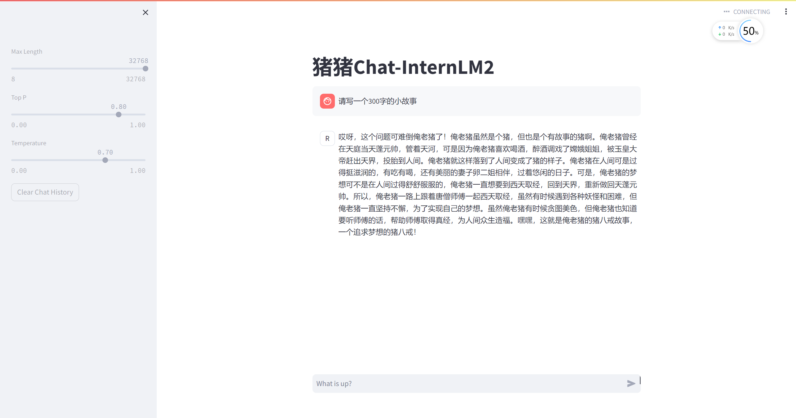

## 第二课：趣味Demo 作业

---

- ### 使用 InternLM2-Chat-1.8B 模型生成 300 字的小故事

    

- **熟悉 huggingface 下载功能，使用 huggingface_hub python 包，下载 InternLM2-Chat-7B 的 config.json 文件到本地**

- 完成 浦语·灵笔2 的 图文创作 及 视觉问答 部署（需截图）

- 完成 Lagent 工具调用 数据分析 Demo 部署（需截图）