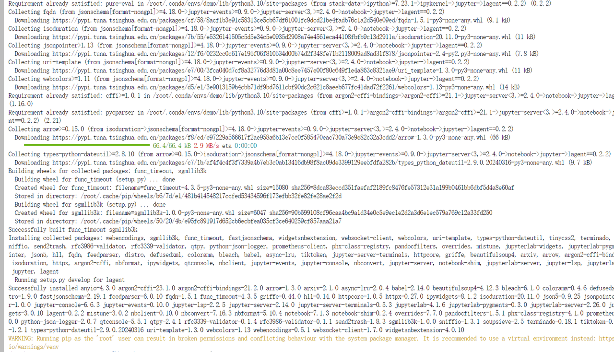
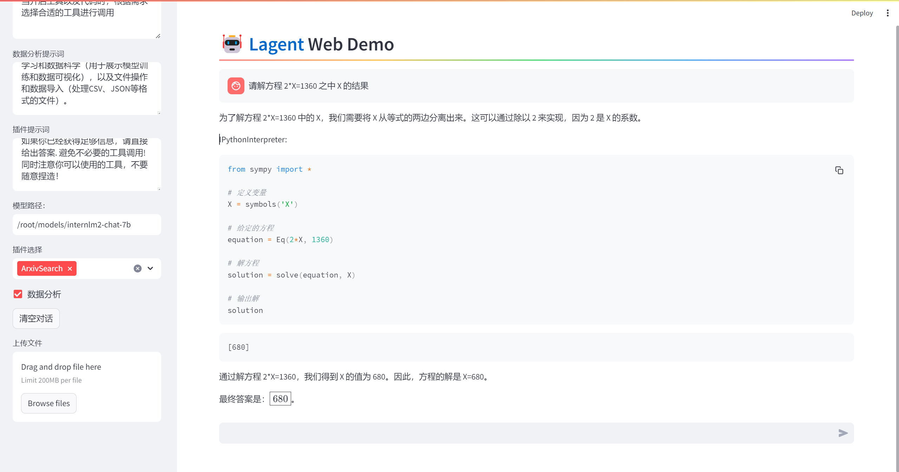

## 第二课：趣味Demo 作业

### 基础

---

- ### 使用 InternLM2-Chat-1.8B 模型生成 300 字的小故事

    

### 进阶

---

1. 熟悉 huggingface 下载功能，使用 huggingface_hub python 包，下载 InternLM2-Chat-7B 的 config.json 文件到本地（需截图下载过程）

- 为什么下载会在/userhome/cache:

> https://zhuanlan.zhihu.com/p/663712983?utm_id=0

原理是因为huggingface工具链会在 .cache/huggingface/ 下维护一份模型的符号链接，无论你是否指定了模型的存储路径 ，缓存目录下都会链接过去，这样可以避免自己忘了自己曾经下过某个模型，此外调用的时候就很方便。

`--local-dir-use-symlinks False`

2. 完成 浦语·灵笔2 的 图文创作 及 视觉问答 部署（需截图）
    图文创作：

3. 完成 Lagent 工具调用 数据分析 Demo 部署（需截图）

结果：

`git clone https://gitee.com/internlm/lagent.git`

`git clone https://github.com/internlm/lagent.git`

`cd /root/demo/lagent`

`git checkout 581d9fb8987a5d9b72bb9ebd37a95efd47d479ac`

`pip install -e .` # 源码安装

4.3 使用 Lagent 运行 InternLM2-Chat-7B 模型为内核的智能体

## 实战：实践部署 浦语·灵笔2 模型

### XComposer2 

浦语·灵笔2 是基于 书生·浦语2 大语言模型研发的突破性的图文多模态大模型，具有非凡的图文写作和图像理解能力，在多种应用场景表现出色，总结起来其具有：

自由指令输入的图文写作能力： 浦语·灵笔2 可以理解自由形式的图文指令输入，包括大纲、文章细节要求、参考图片等，为用户打造图文并貌的专属文章。生成的文章文采斐然，图文相得益彰，提供沉浸式的阅读体验。
准确的图文问题解答能力：浦语·灵笔2 具有海量图文知识，可以准确的回复各种图文问答难题，在识别、感知、细节描述、视觉推理等能力上表现惊人。
杰出的综合能力： 浦语·灵笔2-7B 基于 书生·浦语2-7B 模型，在13项多模态评测中大幅领先同量级多模态模型，在其中6项评测中超过 GPT-4V 和 Gemini Pro。

