## 第二课. 浦语大模型趣味 Demo-笔记

---
- 实战部署 InternLM2-Chat-1.8B

  1.创建并熟悉开发机

  2.下载InternLM2-Chat-1.8B 模型3.尝试部署本地 Client Demo


- 运行Lagent demo

    1. 进一步了解 Lagent 智能体
    2. 部署 InternLM2-Chat-7B
    3. 体验与智能体 Demo 的聊天互动


- 部署
    - 1.部署等 InternLM-XComposer2
    - 2.浅尝视觉问答和图文生成 Demo

1. 创建开发机

   配置环境：`studio-conda -o internlm-base -t demo`

   激活：`conda activate demo`

   安装pip：按照文档执行即可

对三个优秀模型进行实操：
- 八戒-Chat-1.8B：https://www.modelscope.cn/models/JimmyMa99/BaJie-Chat-mini/summary
- Chat-嬛嬛-1.8B：https://openxlab.org.cn/models/detail/BYCJS/huanhuan-chat-internlm2-1_8b
- Mini-Horo-巧耳：https://openxlab.org.cn/models/detail/SaaRaaS/Horowag_Mini

2. 下载 InternLM2-Chat-1.8B 模型

   执行目录，进入文件夹：

   `mkdir -p /root/demo`

   `touch /root/demo/cli_demo.py`

   `touch /root/demo/download_mini.py`

   `cd /root/demo`
   在`/root/demo/download_mini.py` 文件中，复制：

    ```python
    import os
    from modelscope.hub.snapshot_download import snapshot_download
    
    # 创建保存模型目录
    os.system("mkdir /root/models")
    
    # save_dir是模型保存到本地的目录
    save_dir="/root/models"
    
    snapshot_download("Shanghai_AI_Laboratory/internlm2-chat-1_8b", 
                      cache_dir=save_dir, 
                      revision='v1.1.0')
    
    ```

下载模型参数文件:`python /root/demo/download_mini.py`
效果：

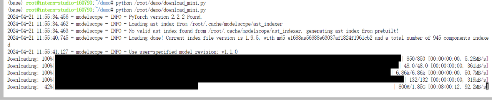

运行 cli_demo:

执行以下代码：

```python
import torch
from transformers import AutoTokenizer, AutoModelForCausalLM


model_name_or_path = "/root/models/Shanghai_AI_Laboratory/internlm2-chat-1_8b"

tokenizer = AutoTokenizer.from_pretrained(model_name_or_path, trust_remote_code=True, device_map='cuda:0')
model = AutoModelForCausalLM.from_pretrained(model_name_or_path, trust_remote_code=True, torch_dtype=torch.bfloat16, device_map='cuda:0')
model = model.eval()

system_prompt = """You are an AI assistant whose name is InternLM (书生·浦语).
- InternLM (书生·浦语) is a conversational language model that is developed by Shanghai AI Laboratory (上海人工智能实验室). It is designed to be helpful, honest, and harmless.
- InternLM (书生·浦语) can understand and communicate fluently in the language chosen by the user such as English and 中文.
"""

messages = [(system_prompt, '')]

print("=============Welcome to InternLM chatbot, type 'exit' to exit.=============")

while True:
    input_text = input("\nUser  >>> ")
    input_text = input_text.replace(' ', '')
    if input_text == "exit":
        break

    length = 0
    for response, _ in model.stream_chat(tokenizer, input_text, messages):
        if response is not None:
            print(response[length:], flush=True, end="")
            length = len(response)

```


遇到问题：

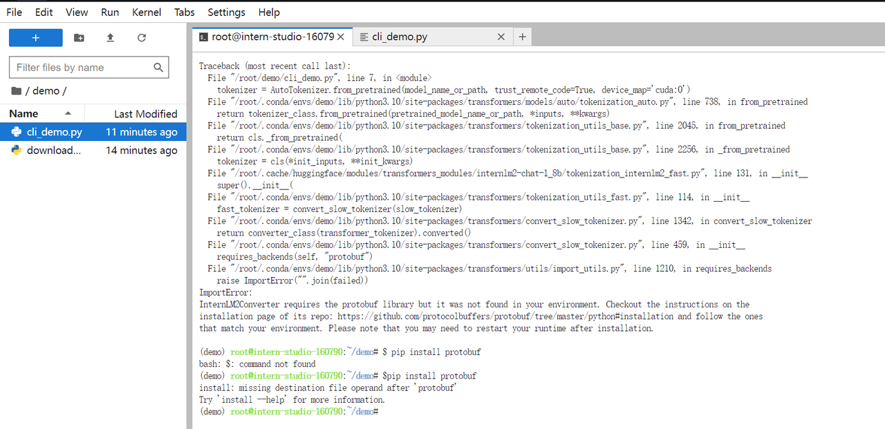


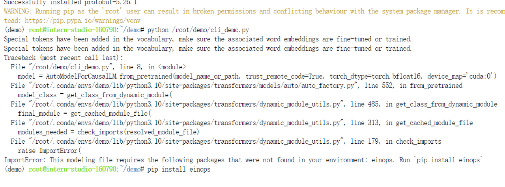

安装：`pip install einops`

遇到：

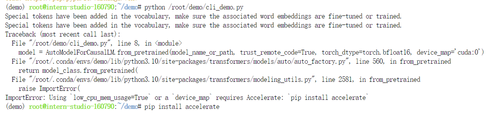

安装：`pip install accelerate`

成功：开始loading

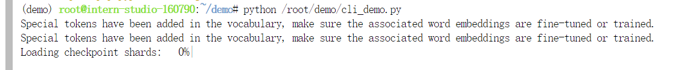

`conda activate demo`

`python /root/demo/cli_demo.py`

键入内容示例：

```text
请创作一个 300 字的小故事
```

最终效果：

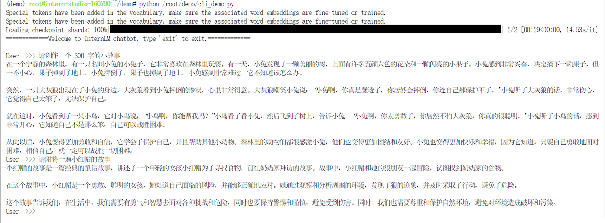


**3. 实战：部署实战营优秀作品 八戒-Chat-1.8B 模型**

（1）：创建demo：

`conda activate demo`

`cd /root/`

`git clone https://gitee.com/InternLM/Tutorial -b camp2`

或者：`git clone https://github.com/InternLM/Tutorial -b camp2`

`cd /root/Tutorial`

（2）运行demo

`python /root/Tutorial/helloworld/bajie_download.py`

遇到需要下载：`mindscope`

运行成功：

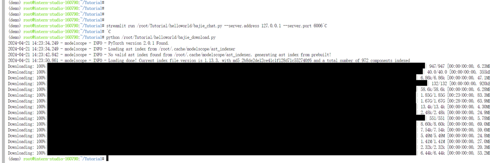

待程序下载完成后，输入运行命令：

`streamlit run /root/Tutorial/helloworld/bajie_chat.py --server.address 127.0.0.1 --server.port 6006`

连接本地powershell和终端：

查询端口：

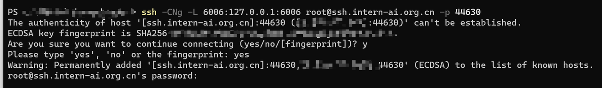


```python
# 从本地使用 ssh 连接 studio 端口
# 将下方端口号 38374 替换成自己的端口号
ssh -CNg -L 6006:127.0.0.1:6006 root@ssh.intern-ai.org.cn -p 38374
```

复制下方的密码，输入到 password 中。


打开 http://127.0.0.1:6006 后，键入内容示例如下：

```text
你好，请自我介绍
```

结果：

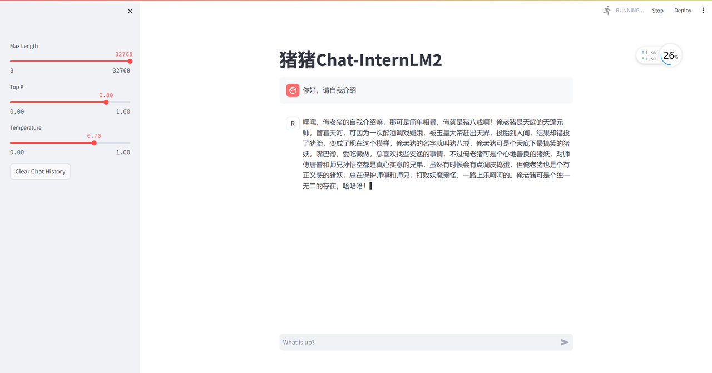

4 实战：使用 Lagent 运行 InternLM2-Chat-7B 模型

Lagent 是一个轻量级、开源的基于大语言模型的智能体（agent）框架，支持用户快速地将一个大语言模型转变为多种类型的智能体，并提供了一些典型工具为大语言模型赋能。它的整个框架图如下

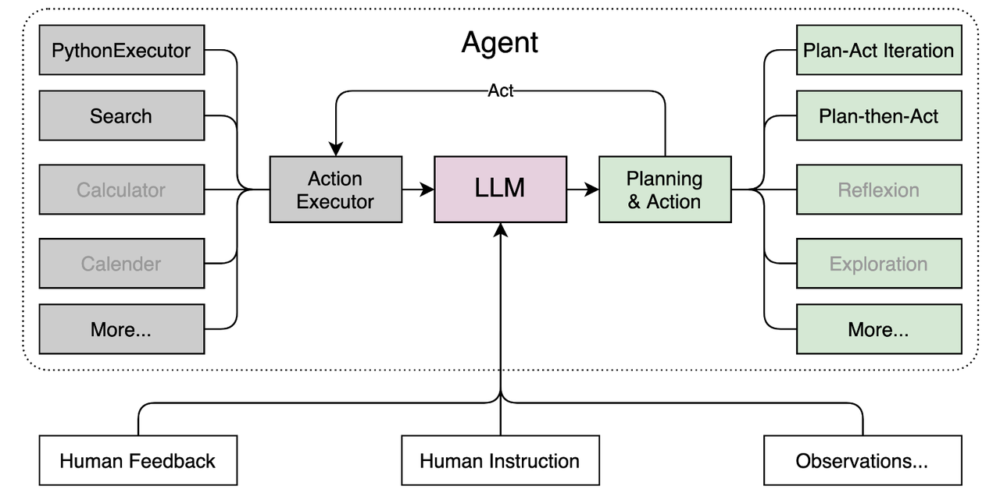


结果：

`git clone https://gitee.com/internlm/lagent.git`

`git clone https://github.com/internlm/lagent.git`

`cd /root/demo/lagent`

`git checkout 581d9fb8987a5d9b72bb9ebd37a95efd47d479ac`

`pip install -e .` # 源码安装

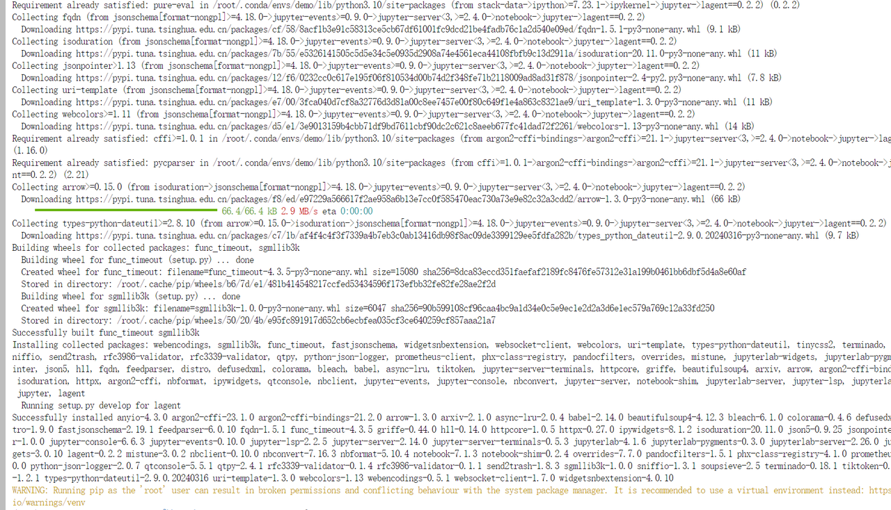

4.3 使用 Lagent 运行 InternLM2-Chat-7B 模型为内核的智能体

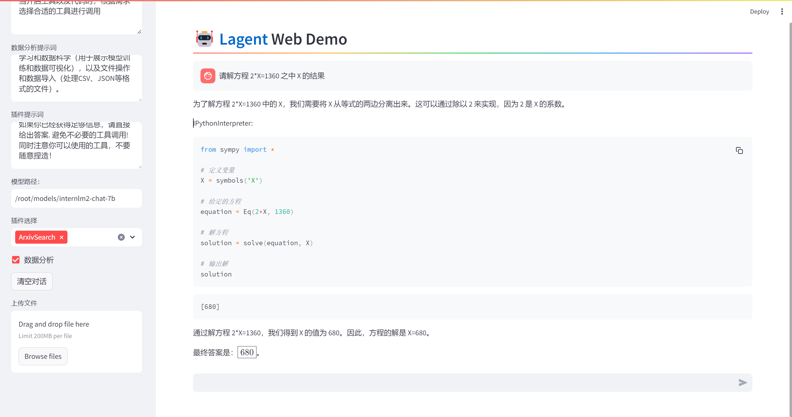

