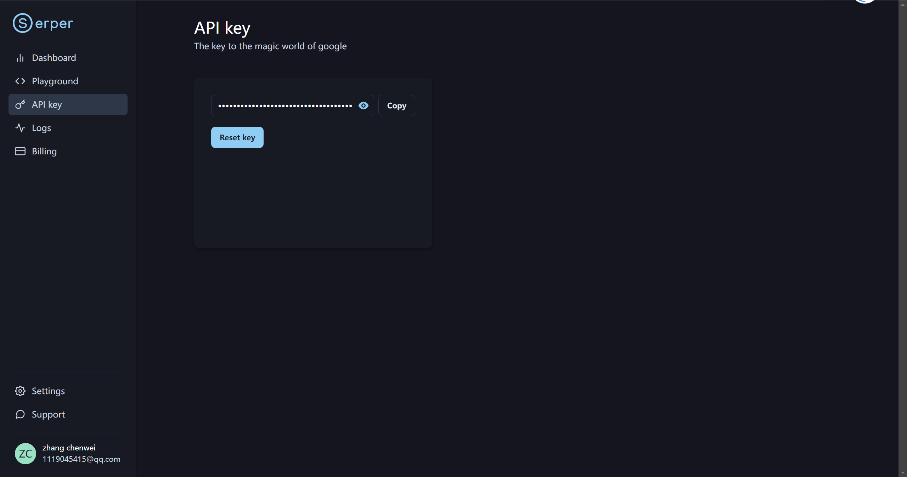
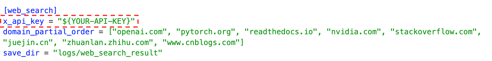
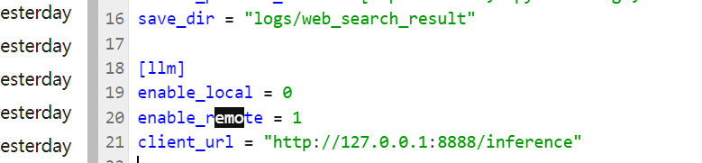
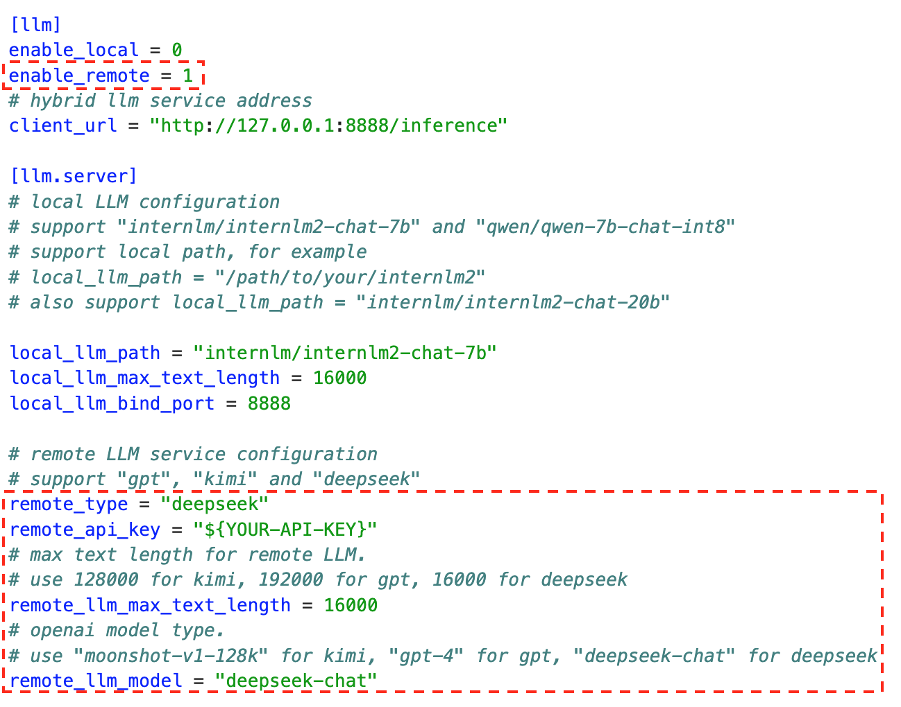
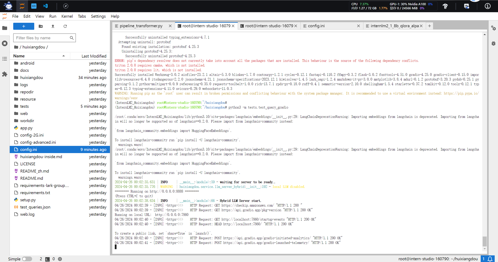
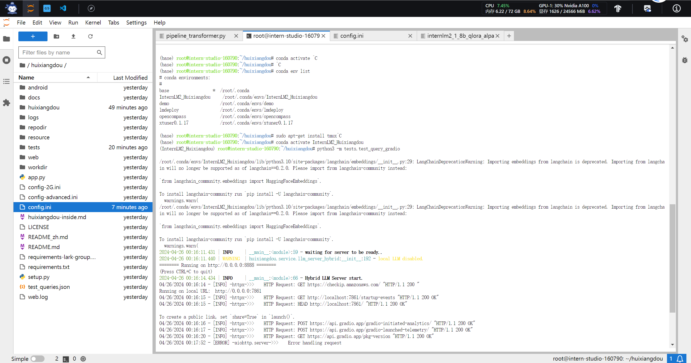

## 第三课。茴香豆

1. RAG 了解

   结合外部知识库来生成更准确、更丰富的回答

    


复制运行InternalLM环境:

`studio-conda -o internlm-base -t InternLM2_Huixiangdou`

激活 :

`conda activate InternLM2_Huixiangdou`


以InternLM2-Chat-7B 作为基础模型

安装依赖:

`pip install protobuf==4.25.3 accelerate==0.28.0 aiohttp==3.9.3 auto-gptq==0.7.1 bcembedding==0.1.3 beautifulsoup4==4.8.2 einops==0.7.0 faiss-gpu==1.7.2 langchain==0.1.14 loguru==0.7.2 lxml_html_clean==0.1.0 openai==1.16.1 openpyxl==3.1.2 pandas==2.2.1 pydantic==2.6.4 pymupdf==1.24.1 python-docx==1.1.0 pytoml==0.1.21 readability-lxml==0.8.1 redis==5.0.3 requests==2.31.0 scikit-learn==1.4.1.post1 sentence_transformers==2.2.2 textract==1.6.5 tiktoken==0.6.0 transformers==4.39.3 transformers_stream_generator==0.0.5 unstructured==0.11.2`

下载茴香豆:

`git clone https://github.com/internlm/huixiangdou && cd huixiangdou`

### 使用茴香豆搭建 RAG 助手

---

修改配置`/root/huixiangdou/config.ini`:

- '6s#.*#embedding_model_path = "/root/models/bce-embedding-base_v1"#': 向量数据库和词嵌入

- '7s#.*#reranker_model_path = "/root/models/bce-reranker-base_v1"#': 检索的重排

- '29s#.*#local_llm_path = "/root/models/internlm2-chat-7b"#': 使用chat-7b模型

### 创建知识库

---

在不重新训练的情况下，搭建一个问答助手：

下载 Huixiangdou 语料:

`git clone https://github.com/internlm/huixiangdou --depth=1 repodir/huixiangdou`

- LangChain : 数据库向量化

- 网易 BCE 双语模型: 默认嵌入和重排序模型


接受和拒答两个向量数据库:

```text

接受问题列表，希望茴香豆助手回答的示例问题
    存储在 huixiangdou/resource/good_questions.json 中
拒绝问题列表，希望茴香豆助手拒答的示例问题
   存储在 huixiangdou/resource/bad_questions.json 中
   其中多为技术无关的主题或闲聊
   如："nihui 是谁", "具体在哪些位置进行修改？", "你是谁？", "1+1"
```

通过以上操作确定好语料来源后，运行下面的命令，创建 RAG 检索过程中使用的向量数据库：

```shell
# 创建向量数据库存储目录
cd /root/huixiangdou && mkdir workdir 

# 分别向量化知识语料、接受问题和拒绝问题中后保存到 workdir
python3 -m huixiangdou.service.feature_store --sample ./test_queries.json

```

检索过程中，茴香豆会将输入问题与两个列表中的问题在向量空间进行**相似性比较**，判断该问题是否应该回答，避免群聊过程中的问答泛滥。确定的回答的问题会利用基础模型提取关键词，在知识库中检索 top K 相似的 chunk，综合问题和检索到的 chunk 生成答案


### 开始测试运行

---

```shell
# 填入问题
sed -i '74s/.*/    queries = ["huixiangdou 是什么？", "茴香豆怎么部署到微信群", "今天天气怎么样？"]/' /root/huixiangdou/huixiangdou/main.py

# 运行茴香豆
cd /root/huixiangdou/
python3 -m huixiangdou.main --standalone # 单机运行

```

### 进阶

#### 加入网络搜索

茴香豆除了可以从本地向量数据库中检索内容进行回答，也可以加入网络的搜索结果，生成回答。

开启网络搜索功能需要用到 Serper 提供的 API：



domain_partial_order 可以设置网络搜索的范围




#### 使用远程模型

茴香豆除了可以使用本地大模型，还可以轻松的调用云端模型 API。

目前，茴香豆已经支持 Kimi，GPT-4，Deepseek 和 GLM 等常见大模型API。

想要使用远端大模型，首先修改 /huixiangdou/config.ini 文件中



```python
enable_local = 0 # 关闭本地模型
enable_remote = 1 # 启用云端模型
```

修改 remote_ 相关配置，填写 API key、模型类型等参数:



启用远程模型可以大大降低GPU显存需求，根据测试，采用远程模型的茴香豆应用，最小只需要2G显存即可。

需要注意的是，这里启用的远程模型，只用在问答分析和问题生成，依然需要本地嵌入、重排序模型进行特征提取。



#### 利用 Gradio 搭建网页 Demo

用 Gradio 搭建一个自己的网页对话 Demo:

安装依赖组件：

`pip install gradio==4.25.0 redis==5.0.3 flask==3.0.2 lark_oapi==1.2.4`

运行脚本，启动茴香豆对话 Demo 服务：

`cd /root/huixiangdou`

`python3 -m tests.test_query_gradio `

运行：

`浏览器中输入 127.0.0.1:7860浏览器中输入 127.0.0.1:7860`

接收到请求 ：



**针对远程服务器**，如我们的 Intern Studio 开发机，我们需要设置端口映射，转发端口到本地浏览器：

查询开发机端口和密码（图中端口示例为 38374）：


#### 配置文件解析

茴香豆的配置文件位于代码主目录下，采用 Toml 形式，有着丰富的功能，下面将解析配置文件中重要的常用参数。

```shell
[feature_store]
...
reject_throttle = 0.22742061846268935
...
embedding_model_path = "/root/models/bce-embedding-base_v1"
reranker_model_path = "/root/models/bce-reranker-base_v1"
...
work_dir = "workdir"
```

reject_throttle: 拒答阈值，0-1，数值越大，回答的问题相关性越高。拒答分数在检索过程中通过与示例问题的相似性检索得出，高质量的问题得分高，无关、低质量的问题得分低。只有得分数大于拒答阈值的才会被视为相关问题，用于回答的生成。当闲聊或无关问题较多的环境可以适当调高。 embedding_model_path 和 reranker_model_path: 嵌入和重排用到的模型路径。不设置本地模型路径情况下，默认自动通过 Huggingface 下载。开始自动下载前，需要使用下列命令登录 Huggingface 账户获取权限：

`huggingface-cli login`

`work_dir`: 向量数据库路径

local_llm_path: 本地模型文件夹路径或模型名称。现支持 书生·浦语 和 通义千问 模型类型，调用 transformers 的 AutoModels 模块，除了模型路径，输入 Huggingface 上的模型名称，如*"internlm/internlm2-chat-7b"、"qwen/qwen-7b-chat-int8"、"internlm/internlm2-chat-20b"*，也可自动拉取模型文件。 local_llm_max_text_length: 模型可接受最大文本长度


[worker]: 增强搜索功能，配合 [sg_search] 使用。增强搜索利用知识领域的源文件建立图数据库，当模型判断问题为无关问题或回答失败时，增强搜索功能将利用 LLM 提取的关键词在该图数据库中搜索，并尝试用搜索到的内容重新生成答案。在 config.ini 中查看 [sg_search] 具体配置示例。

[worker.time]: 可以设置茴香豆每天的工作时间，通过 start 和 end 设定应答的起始和结束时间。 has_weekday: = 1 的时候，周末不应答