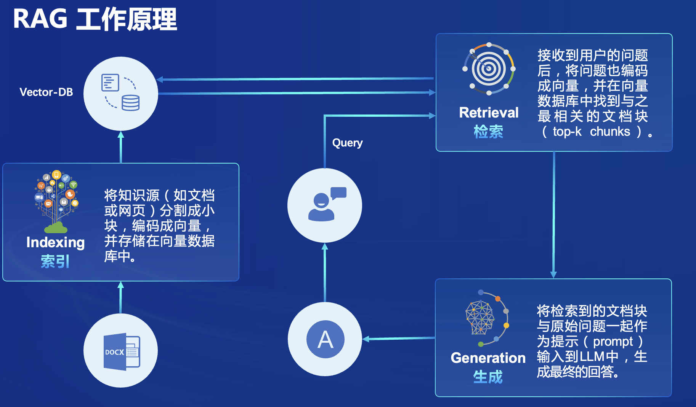

## 第三课。茴香豆

1. RAG 了解

   结合外部知识库来生成更准确、更丰富的回答

    


复制运行InternalLM环境:

`studio-conda -o internlm-base -t InternLM2_Huixiangdou`

激活 :

`conda activate InternLM2_Huixiangdou`


以InternLM2-Chat-7B 作为基础模型

安装依赖:

`pip install protobuf==4.25.3 accelerate==0.28.0 aiohttp==3.9.3 auto-gptq==0.7.1 bcembedding==0.1.3 beautifulsoup4==4.8.2 einops==0.7.0 faiss-gpu==1.7.2 langchain==0.1.14 loguru==0.7.2 lxml_html_clean==0.1.0 openai==1.16.1 openpyxl==3.1.2 pandas==2.2.1 pydantic==2.6.4 pymupdf==1.24.1 python-docx==1.1.0 pytoml==0.1.21 readability-lxml==0.8.1 redis==5.0.3 requests==2.31.0 scikit-learn==1.4.1.post1 sentence_transformers==2.2.2 textract==1.6.5 tiktoken==0.6.0 transformers==4.39.3 transformers_stream_generator==0.0.5 unstructured==0.11.2`

下载茴香豆:

`git clone https://github.com/internlm/huixiangdou && cd huixiangdou`

### 使用茴香豆搭建 RAG 助手

---

修改配置`/root/huixiangdou/config.ini`:

- '6s#.*#embedding_model_path = "/root/models/bce-embedding-base_v1"#': 向量数据库和词嵌入

- '7s#.*#reranker_model_path = "/root/models/bce-reranker-base_v1"#': 检索的重排

- '29s#.*#local_llm_path = "/root/models/internlm2-chat-7b"#': 使用chat-7b模型

### 创建知识库

---

在不重新训练的情况下，搭建一个问答助手：

下载 Huixiangdou 语料:

`git clone https://github.com/internlm/huixiangdou --depth=1 repodir/huixiangdou`

- LangChain : 数据库向量化

- 网易 BCE 双语模型: 默认嵌入和重排序模型


接受和拒答两个向量数据库:

```text

接受问题列表，希望茴香豆助手回答的示例问题
    存储在 huixiangdou/resource/good_questions.json 中
拒绝问题列表，希望茴香豆助手拒答的示例问题
   存储在 huixiangdou/resource/bad_questions.json 中
   其中多为技术无关的主题或闲聊
   如："nihui 是谁", "具体在哪些位置进行修改？", "你是谁？", "1+1"
```

通过以上操作确定好语料来源后，运行下面的命令，创建 RAG 检索过程中使用的向量数据库：

```shell
# 创建向量数据库存储目录
cd /root/huixiangdou && mkdir workdir 

# 分别向量化知识语料、接受问题和拒绝问题中后保存到 workdir
python3 -m huixiangdou.service.feature_store --sample ./test_queries.json

```

检索过程中，茴香豆会将输入问题与两个列表中的问题在向量空间进行**相似性比较**，判断该问题是否应该回答，避免群聊过程中的问答泛滥。确定的回答的问题会利用基础模型提取关键词，在知识库中检索 top K 相似的 chunk，综合问题和检索到的 chunk 生成答案


### 开始测试运行

---

```shell
# 填入问题
sed -i '74s/.*/    queries = ["huixiangdou 是什么？", "茴香豆怎么部署到微信群", "今天天气怎么样？"]/' /root/huixiangdou/huixiangdou/main.py

# 运行茴香豆
cd /root/huixiangdou/
python3 -m huixiangdou.main --standalone # 单机运行

```


