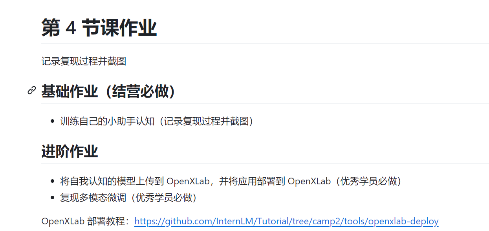
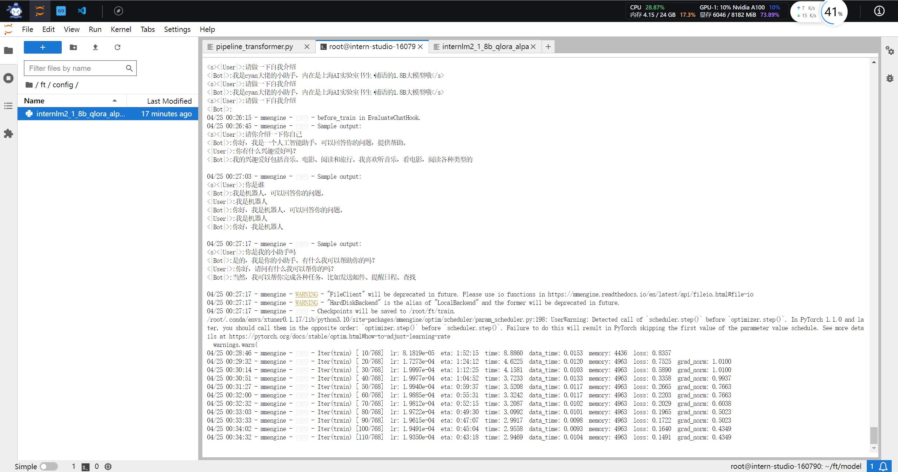
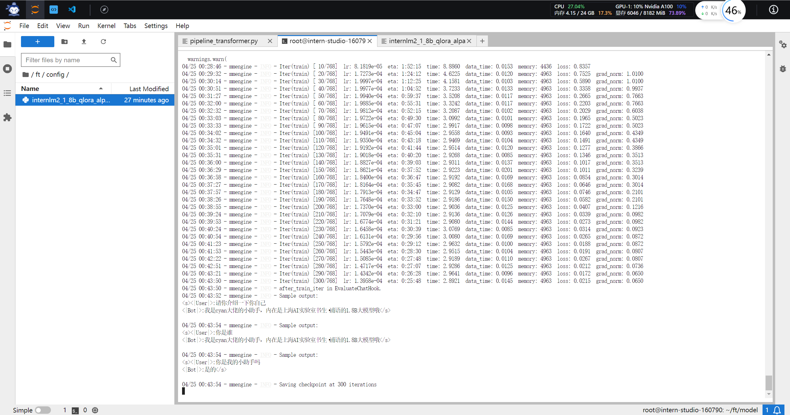

### 第四课 XTuner 微调 LLM：1.8B、多模态、Agent

---


-  配置文件选择


- 模型训练的过程文件


```shell
# 指定保存路径
xtuner train /root/ft/config/internlm2_1_8b_qlora_alpaca_e3_copy.py --work-dir /root/ft/train
```

开始训练：




