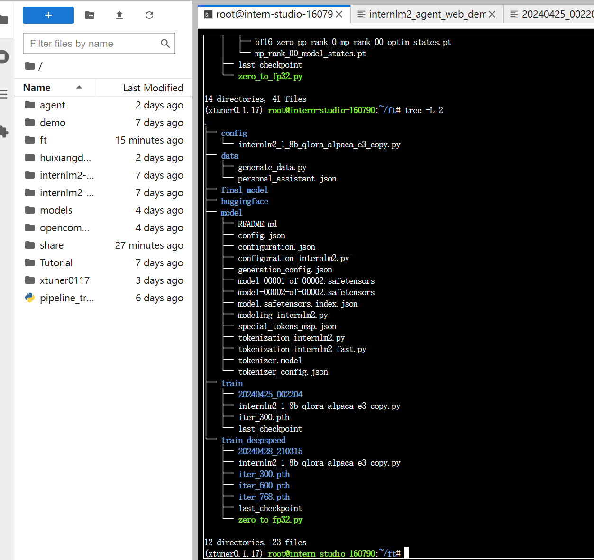

## XTuner 微调 LLM


---

### XTuner 微调多模态LLM

---


安装一个 XTuner 的源码:

`studio-conda xtuner0.1.1`

- 数据集准备


- 模型准备

```shell
|-- model/
    |-- tokenizer.model
    |-- config.json
    |-- tokenization_internlm2.py
    |-- model-00002-of-00002.safetensors
    |-- tokenizer_config.json
    |-- model-00001-of-00002.safetensors
    |-- model.safetensors.index.json
    |-- configuration.json
    |-- special_tokens_map.json
    |-- modeling_internlm2.py
    |-- README.md
    |-- configuration_internlm2.py
    |-- generation_config.json
    |-- tokenization_internlm2_fast.py
```

- 配置文件选择

  用于定义和控制模型训练和测试过程中各个方面的参数和设置的工具

```shell
# 列出所有内置配置文件
# xtuner list-cfg

# 假如我们想找到 internlm2-1.8b 模型里支持的配置文件
xtuner list-cfg -p internlm2_1_8b
```

    - list-cfg: 配置文件搜索：可以加上一个参数 -p 或 --pattern ，后面输入的内容将会在所有的 config 文件里进行模糊匹配搜索
    
    - copy-cfg： {CONFIG_NAME} 对应的是上面搜索到的 internlm2_1_8b_qlora_alpaca_e3 ,而 {SAVE_PATH} 则对应的是刚刚新建的 /root/ft/config

        `xtuner copy-cfg {CONFIG_NAME} {SAVE_PATH}




- 模型训练

  模型过拟合：

  措施：减少保存权重文件的间隔并增加权重文件保存的上限、增加常规的对话数据集从而稀释原本数据的占比


使用 deepspeed 来加速训练:

`xtuner train /root/ft/config/internlm2_1_8b_qlora_alpaca_e3_copy.py --work-dir /root/ft/train_deepspeed --deepspeed deepspeed_zero2`


下来拿300和600轮次：

```shell
# Save
save_steps = 300
save_total_limit = 3  # Maximum checkpoints to keep (-1 means unlimited)

```

300轮效果：


对此事我们用的模型已经过拟合，解决办法：

1. 减少保存权重文件的间隔并增加权重文件保存的上限：这个方法实际上就是通过降低间隔结合评估问题的结果，从而找到最优的权重文。我们可以每隔100个批次来看什么时候模型已经学到了这部分知识但是还保留着基本的常识，什么时候已经过拟合严重只会说一句话了。但是由于再配置文件有设置权重文件保存数量的上限，因此同时将这个上限加大也是非常必要的。

2. 增加常规的对话数据集从而稀释原本数据的占比：这个方法其实就是希望我们正常用对话数据集做指令微调的同时还加上一部分的数据集来让模型既能够学到正常对话，但是在遇到特定问题时进行特殊化处理。比如说我在一万条正常的对话数据里混入两千条和小助手相关的数据集，这样模型同样可以在不丢失对话能力的前提下学到剑锋大佬的小助手这句话。这种其实是比较常见的处理方式，大家可以自己动手尝试实践一下。

---

模型续训：

在原有指令的基础上加上 --resume {checkpoint_path} 来实现模型的继续训练。

**注意**：这个继续训练得到的权重文件和中断前的完全一致，并不会有任何区别

```shell
# 模型续训
xtuner train /root/ft/config/internlm2_1_8b_qlora_alpaca_e3_copy.py --work-dir /root/ft/train --resume /root/ft/train/iter_600.pth
```

----

## 模型转换、整合、测试及部署

- 模型转换
  
  模型转换的本质其实就是将原本使用 Pytorch 训练出来的模型权重文件转换为目前通用的 Huggingface 格式文件，那么我们可以通过以下指令来实现一键转换。

```shell
# 创建一个保存转换后 Huggingface 格式的文件夹
mkdir -p /root/ft/huggingface

# 模型转换
# xtuner convert pth_to_hf ${配置文件地址} ${权重文件地址} ${转换后模型保存地址}
xtuner convert pth_to_hf /root/ft/train/internlm2_1_8b_qlora_alpaca_e3_copy.py /root/ft/train/iter_768.pth /root/ft/huggingface
```

- 整合

对于 LoRA 或者 QLoRA 微调出来的模型其实并不是一个完整的模型，而是一个额外的层（adapter）。那么训练完的这个层最终还是要与原模型进行组合才能被正常的使用

对于全量微调的模型（full）其实是不需要进行整合这一步的，因为全量微调修改的是原模型的权重而非微调一个新的 adapter ，因此是不需要进行模型整合的

在 XTuner 中也是提供了一键整合的指令，但是在使用前我们需要准备好三个地址，包括原模型的地址、训练好的 adapter 层的地址（转为 Huggingface 格式后保存的部分）以及最终保存的地址。

```shell
# 创建一个名为 final_model 的文件夹存储整合后的模型文件
mkdir -p /root/ft/final_model

# 解决一下线程冲突的 Bug 
export MKL_SERVICE_FORCE_INTEL=1

# 进行模型整合
# xtuner convert merge  ${NAME_OR_PATH_TO_LLM} ${NAME_OR_PATH_TO_ADAPTER} ${SAVE_PATH} 
xtuner convert merge /root/ft/model /root/ft/huggingface /root/ft/final_model
```
那除了以上的三个基本参数以外，其实在模型整合这一步还是其他很多的可选参数，包括：

| 参数名 |	解释 |
|---|---|
|--max-shard-size {GB}|	代表每个权重文件最大的大小（默认为2GB）|
|--device {device_name}	| 这里指的就是device的名称，可选择的有cuda、cpu和auto，默认为cuda即使用gpu进行运算|
|--is-clip	|这个参数主要用于确定模型是不是CLIP模型，假如是的话就要加上，不是就不需要添加 |


在模型整合完成后，我们就可以看到 final_model 文件夹里生成了和原模型文件夹非常近似的内容，包括了分词器、权重文件、配置信息等等。当我们整合完成后，我们就能够正常的调用这个模型进行对话测试了


- 对话测试

```shell
# 与模型进行对话
xtuner chat /root/ft/final_model --prompt-template internlm2_chat
```

过拟合效果：


- Web demo 部署

1. 下载网页端 web demo 所需要的依赖。

`pip install streamlit==1.24.0`

2. 下载 InternLM 项目代码

```shell
# 创建存放 InternLM 文件的代码
mkdir -p /root/ft/web_demo && cd /root/ft/web_demo

# 拉取 InternLM 源文件
git clone https://github.com/InternLM/InternLM.git

# 进入该库中
cd /root/ft/web_demo/InternLM
```

将 /root/ft/web_demo/InternLM/chat/web_demo.py 中的内容替换为以下的代码（与源代码相比，此处修改了模型路径和分词器路径，并且也删除了 avatar 及 system_prompt 部分的内容，同时与 cli 中的超参数进行了对齐）


3. 端口映射到本地


效果:


4. 更换模型对话

假如我们还想和原来的 InternLM2-Chat-1.8B 模型对话（即在 /root/ft/model 这里的模型对话），我们其实只需要修改183行和186行的文件地址即可

```shell
# 修改模型地址（第183行）
- model = (AutoModelForCausalLM.from_pretrained('/root/ft/final_model',
+ model = (AutoModelForCausalLM.from_pretrained('/root/ft/model',

# 修改分词器地址（第186行）
- tokenizer = AutoTokenizer.from_pretrained('/root/ft/final_model',
+ tokenizer = AutoTokenizer.from_pretrained('/root/ft/model',
```

运行:
`streamlit run /root/ft/web_demo/InternLM/chat/web_demo.py --server.address 127.0.0.1 --server.port 6006`

同样的问题,效果：


## Part 2: 多模态部分

---

