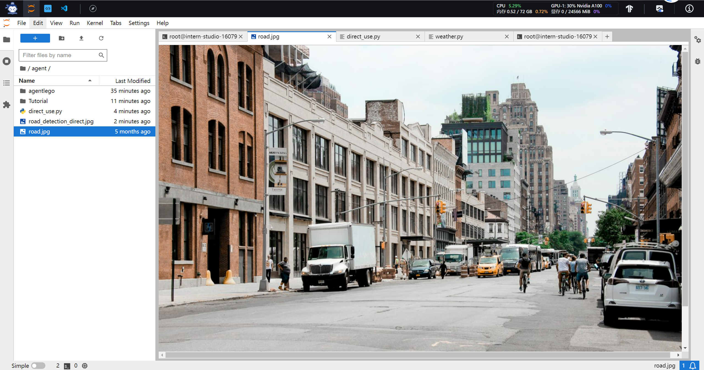
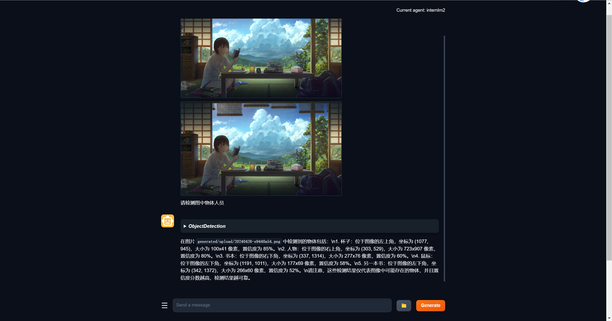

## Lagent & AgentLego 智能体应用搭建

----

**Lagent** 是一个轻量级开源智能体框架，旨在让用户可以高效地构建基于大语言模型的智能体。同时它也提供了一些典型工具以增强大语言模型的能力。


**AgentLego 是什么**

AgentLego 是一个提供了多种开源工具 API 的多模态工具包，旨在像是乐高积木一样，让用户可以快速简便地拓展自定义工具，从而组装出自己的智能体。通过 AgentLego 算法库，不仅可以直接使用多种工具，也可以利用这些工具，在相关智能体框架（如 Lagent，Transformers Agent 等）的帮助下，快速构建可以增强大语言模型能力的智能体。

> Lagent是IG宽假，二AgentLego是一个工具包

配置环境：


安装 Lagent 和 AgentLego:

- 使用pip

- 使用源码:

    ```shell
    cd /root/agent
    conda activate agent
    git clone https://gitee.com/internlm/lagent.git
    cd lagent && git checkout 581d9fb && pip install -e . && cd ..
    git clone https://gitee.com/internlm/agentlego.git
    cd agentlego && git checkout 7769e0d && pip install -e . && cd ..
    ```
  
安装Imdeploy:

```shell
conda activate agent
pip install lmdeploy==0.3.0
```

准备 Tutorial:

```shell
cd /root/agent
git clone -b camp2 https://gitee.com/internlm/Tutorial.git
```

# 作业

---

## Lagent：轻量级智能体框架

---

Lagent Web Demo

启动启动一个 api_server：

启动 Lagent Web Demo：

两个启动后，ssh链接到本地端口，游览器输入: `http://localhost:7860/`


```shell
conda activate agent
cd /root/agent/lagent/examples
streamlit run internlm2_agent_web_demo.py --server.address 127.0.0.1 --server.port 7860
```


两者启动后,在本地进行端口映射，将 LMDeploy api_server 的23333端口以及 Lagent Web Demo 的7860端口映射到本地。可以执行：

`ssh -CNg -L 7860:127.0.0.1:7860 -L 23333:127.0.0.1:23333 root@ssh.intern-ai.org.cn -p <你的 ssh 端口号>`

接下来在本地的浏览器页面中打开 http://localhost:7860 以使用 Lagent Web Demo。首先输入模型 IP 为 127.0.0.1:23333，在输入完成后按下回车键以确认。并选择插件为 ArxivSearch，以让模型获得在 arxiv 上搜索论文的能力。


选择arxiv插件：


输入“请帮我搜索 InternLM2 Technical Report” 以让模型搜索书生·浦语2的技术报告。效果如下图所示，可以看到模型正确输出了 InternLM2 技术报告的相关信息。尽管还输出了其他论文，但这是由 arxiv 搜索 API 的相关行为导致的.

测试:


在本节中，我们将基于 Lagent 自定义一个工具。Lagent 中关于工具部分的介绍文档位于 https://lagent.readthedocs.io/zh-cn/latest/tutorials/action.html 。使用 Lagent 自定义工具主要分为以下几步：

继承 BaseAction 类
实现简单工具的 run 方法；或者实现工具包内每个子工具的功能
简单工具的 run 方法可选被 tool_api 装饰；工具包内每个子工具的功能都需要被 tool_api 装饰
下面我们将实现一个调用和风天气 API 的工具以完成实时天气查询的功能。

创建文件weather.py

获取 API KEY:


体验自定义工具效果
与 1.2 部分类似，我们在两个 terminal 中分别启动 LMDeploy 服务和 Tutorial 已经写好的用于这部分的 Web Demo：

效果:


> 两个一起启动


## AgentLego：组装智能体“乐高”

----

(1)直接使用 AgentLego:

`wget http://download.openmmlab.com/agentlego/road.jpg`


然后通过 touch /root/agent/direct_use.py（大小写敏感）的方式在 /root/agent 目录下新建 direct_use.py 以直接使用目标检测工具

接下来在执行 python /root/agent/direct_use.py 以进行推理。在等待 RTMDet-Large 权重下载并推理完成后，我们就可以看到如下输出以及一张位于 /root/agent 名为 road_detection_direct.jpg 的图片：

直接使用结果：


原本图:




(2)作为智能体工具使用

由于 AgentLego 算法库默认使用 InternLM2-Chat-20B 模型，因此我们首先需要修改 /root/agent/agentlego/webui/modules/agents/lagent_agent.py 文件的第 105行位置，将 internlm2-chat-20b 修改为 internlm2-chat-7b，即

```python
def llm_internlm2_lmdeploy(cfg):
    url = cfg['url'].strip()
    llm = LMDeployClient(
-         model_name='internlm2-chat-20b',
+         model_name='internlm2-chat-7b',
        url=url,
        meta_template=INTERNLM2_META,
        top_p=0.8,
        top_k=100,
        temperature=cfg.get('temperature', 0.7),
        repetition_penalty=1.0,
        stop_words=['<|im_end|>'])
    return llm
```

使用 LMDeploy 部署

由于 AgentLego 的 WebUI 需要用到 LMDeploy 所启动的 api_server，因此我们首先按照下图指示在 vscode terminal 中执行如下代码使用 LMDeploy 启动一个 api_server。

```shell
conda activate agent
lmdeploy serve api_server /root/share/new_models/Shanghai_AI_Laboratory/internlm2-chat-7b \
                            --server-name 127.0.0.1 \
                            --model-name internlm2-chat-7b \
                            --cache-max-entry-count 0.1
```

启动 AgentLego WebUI:

**新建**一个 terminal 以启动 AgentLego WebUI。在新建的 terminal 中执行如下指令：

```shell
conda activate agent
cd /root/agent/agentlego/webui
python one_click.py
```

之后在本地进行端口映射


接下来在本地的浏览器页面中打开 `http://localhost:7860` 以使用 AgentLego WebUI。


成功加载internlm2:


等待工具加载完成后，点击上方 Chat 以进入对话页面。在页面下方选择工具部分只选择 ObjectDetection 工具，如下图所示。为了确保调用工具的成功率，请在使用时确保仅有这一个工具启用。




#### 用 AgentLego 自定义工具

自定义工具主要分为以下几步：

  继承 BaseTool 类
  修改 default_desc 属性（工具功能描述）
  如有需要，重载 setup 方法（重型模块延迟加载）
  重载 apply 方法（工具功能实现） 

其中第一二四步是必须的步骤。下面我们将实现一个调用 MagicMaker 的 API 以实现图像生成的工具。

创建-注册-实验新工具


MagicMaker 是汇聚了优秀 AI 算法成果的免费 AI 视觉素材生成与创作平台。主要提供图像生成、图像编辑和视频生成三大核心功能，全面满足用户在各种应用场景下的视觉素材创作需求。体验更多功能可以访问 https://magicmaker.openxlab.org.cn/home 。

在 Tool 界面选择 **MagicMakerImageGeneration** 后点击 save 后，回到 Chat 页面选择 MagicMakerImageGeneration 工具后就可以开始使用了。为了确保调用工具的成功率，请在使用时确保仅有这一个工具启用。下图是一个例子。可以看到模型成功地调用了工具并得到了结果。


## Agent 工具能力微调

---

#### OpenAI Function Calling

为了让大语言模型连接到外部工具，OpenAI 推出了 Function calling 的功能。在 调用 OpenAI 的 API 时，可以描述函数并让模型智能地选择要输出的 JSON 对象，其中包含传递给一个或多个函数的参数。


