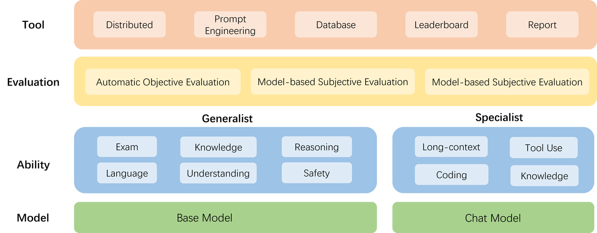

## 大模型的评测

---
### 大模型开源开放评测体系 “司南” (OpenCompass2.0)

---

**基座模型**：一般是经过海量的文本数据以自监督学习的方式进行训练获得的模型（如OpenAI的GPT-3，Meta的LLaMA），往往具有强大的文字续写能力。

**对话模型**：一般是在的基座模型的基础上，经过指令微调或人类偏好对齐获得的模型（如OpenAI的ChatGPT、上海人工智能实验室的书生·浦语），能理解人类指令，具有较强的对话能力。



- 模型层：大模型评测所涉及的主要模型种类，OpenCompass以基座模型和对话模型作为重点评测对象。

- 能力层：OpenCompass从本方案从通用能力和特色能力两个方面来进行评测维度设计。在模型通用能力方面，从语言、知识、理解、推理、安全等多个能力维度进行评测。在特色能力方面，从长文本、代码、工具、知识增强等维度进行评测。

- 方法层：OpenCompass采用客观评测与主观评测两种评测方式。客观评测能便捷地评估模型在具有确定答案（如选择，填空，封闭式问答等）的任务上的能力，主观评测能评估用户对模型回复的真实满意度，OpenCompass采用基于模型辅助的主观评测和基于人类反馈的主观评测两种方式。

- 工具层：OpenCompass提供丰富的功能支持自动化地开展大语言模型的高效评测。包括分布式评测技术，提示词工程，对接评测数据库，评测榜单发布，评测报告生成等诸多功能。

流程：

在 OpenCompass 中评估一个模型通常包括以下几个阶段：配置 -> 推理 -> 评估 -> 可视化。

### 环境安装：

---

```python
studio-conda -o internlm-base -t opencompass
source activate opencompass
git clone -b 0.2.4 https://github.com/open-compass/opencompass
cd opencompass
pip install -e .
```

数据准备:

启动评测 (10% A100 8GB 资源):

```python
python run.py
--datasets ceval_gen \
--hf-path /share/new_models/Shanghai_AI_Laboratory/internlm2-chat-1_8b \  # HuggingFace 模型路径
--tokenizer-path /share/new_models/Shanghai_AI_Laboratory/internlm2-chat-1_8b \  # HuggingFace tokenizer 路径（如果与模型路径相同，可以省略）
--tokenizer-kwargs padding_side='left' truncation='left' trust_remote_code=True \  # 构建 tokenizer 的参数
--model-kwargs device_map='auto' trust_remote_code=True \  # 构建模型的参数
--max-seq-len 1024 \  # 模型可以接受的最大序列长度
--max-out-len 16 \  # 生成的最大 token 数
--batch-size 2  \  # 批量大小
--num-gpus 1  # 运行模型所需的 GPU 数量
--debug
```


